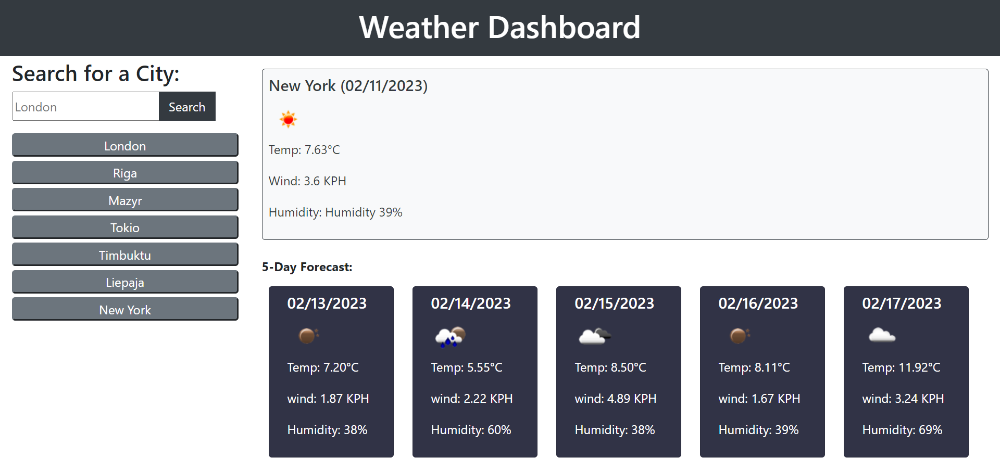

# Weather Dashboard
## Description
This is a repository to hold the code for a basic [Weather Dashboard](https://maijako.github.io/weather-app).
It lets a user search for a city and be presented with current and future conditions for that city, adding the searched cities to search history, as well as view the search history data upon refreshing the page.

The current weather conditions for any city include:
* city name
* date
* an icon representation of weather conditions
* temperature
* humidity
* wind speed

The future weather conditions include a 5-day forecast that displays:

* date
* an icon representation of weather conditions
* temperature
* humidity

## Features
The app features a basic form field that dynamically generates a search history and weather display. The functionality allows users to type in and save their search history, which persists on reloading of the page. Clicking on a button in search history presents the user with current and future conditions for that city.

The current weather conditions for any city include:
* city name
* date
* an icon representation of weather conditions
* temperature
* humidity
* wind speed

The future weather conditions include a 5-day forecast that displays:

* date
* an icon representation of weather conditions
* temperature
* humidity

## Technology used
The Weather Dashboard was built using
* HTML
* CSS
* Bootstrap
* JavaScript
* jQuery
* Moment.js
* [Open Weather Map API](https://api.openweathermap.org)

## Screenshot

## Usage

The app can be used to view current weather and five day forecast for any searchable city.

## Credits

The source code and the original asset files were provided by [Trilogy Education](https://2u.com/) as part of the Front End Web Development bootcamp sponsored by the [Skills For Life](https://skillsforlife.edx.org/) program.

## Licence

This code uses MIT License.
